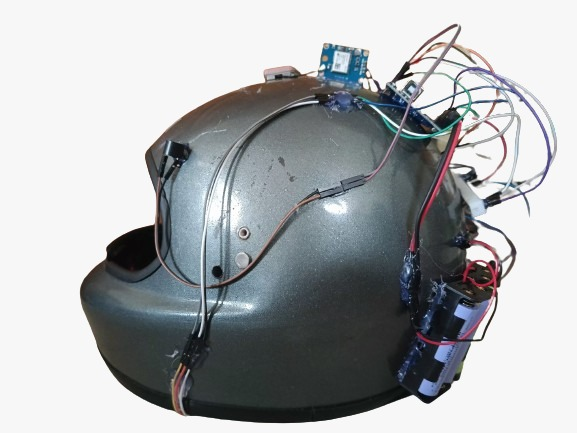
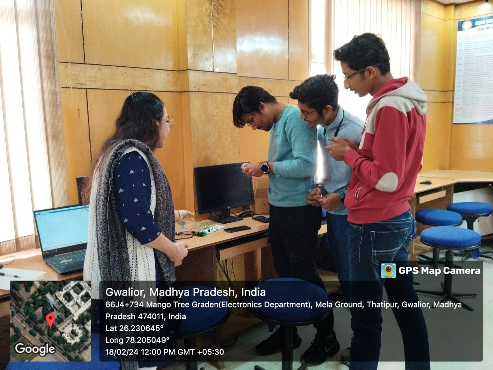
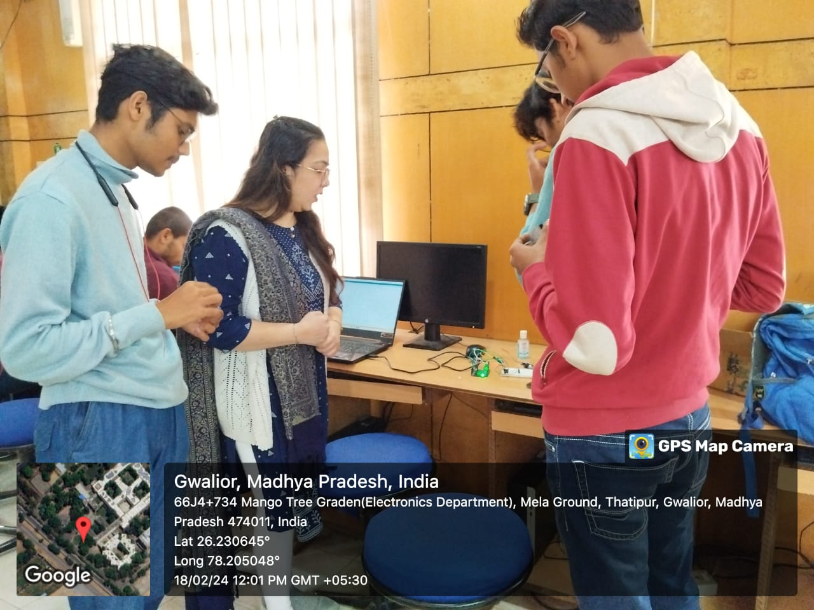
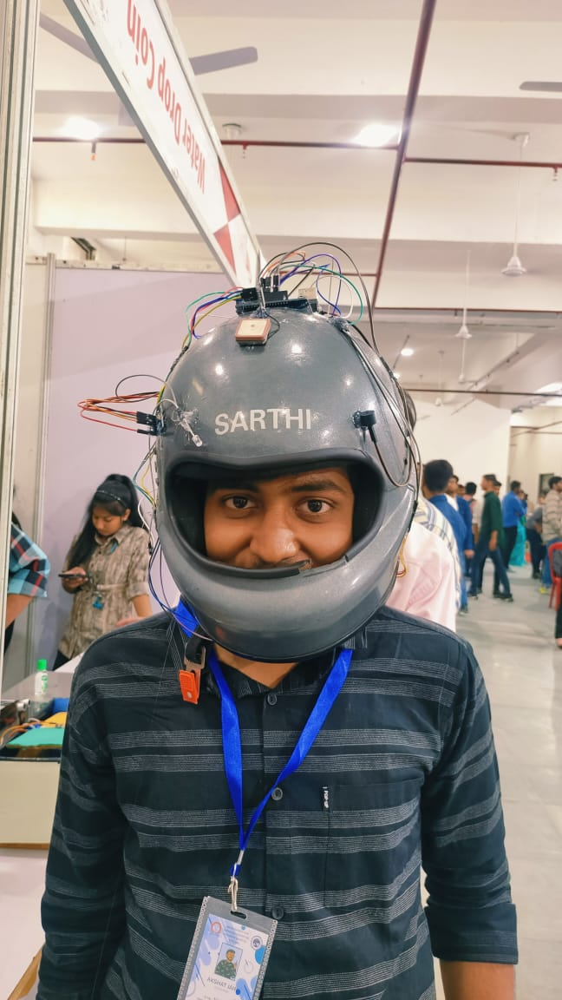
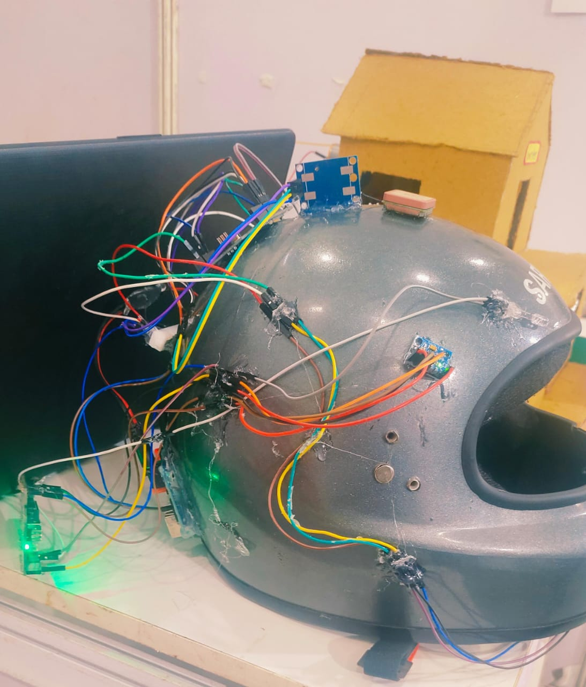
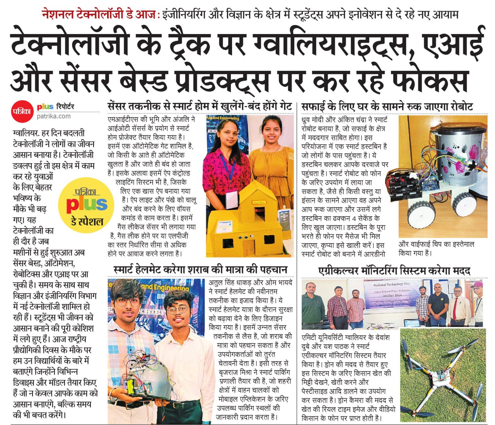
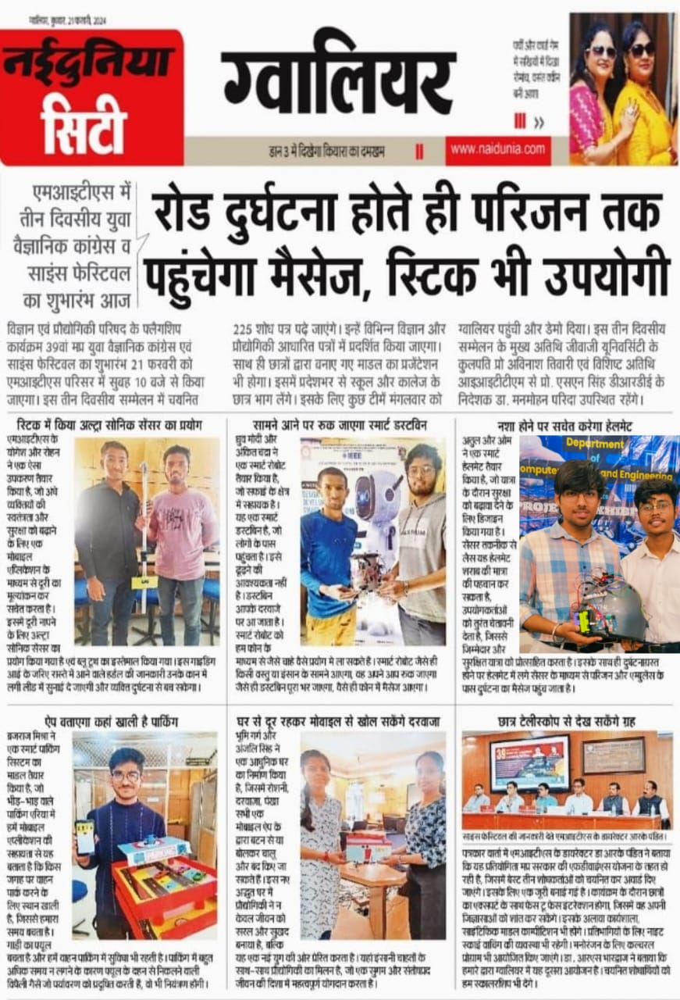

# Description

The Smart Helmet project integrates cutting-edge technology to enhance rider safety. By utilizing accelerometers, gas sensors, GPS modules, and GSM technology, it detects accidents and alcohol presence, providing real-time notifications to emergency contacts along with precise location tracking.

# Photos of Journey
     

# Newspaper Featuring
  

# Smart Helmet Code

This repository contains the code for a Smart Helmet project. The helmet is equipped with various sensors and features for enhanced safety and monitoring. It detects accidents, smoke (alcohol), and provides location tracking using GPS. Notifications are sent via SMS using a GSM module.

## Features

1. **Accident Detection**:
   - Uses the MPU6050 accelerometer to detect severe impacts.
   - Sends an SMS alert to a predefined phone number upon detecting an accident.

2. **Smoke/Alcohol Detection**:
   - Uses an MQ-135 sensor to detect the presence of smoke or alcohol.
   - Sends an SMS alert to a predefined phone number when smoke/alcohol is detected.

3. **GPS Location Tracking**:
   - Retrieves GPS coordinates using a GPS module.
   - Sends a Google Maps link to the predefined phone number for real-time location tracking.

4. **LED Indicators**:
   - LED1 blinks during accident detection.
   - LED2 blinks during smoke/alcohol detection.

## Hardware Requirements

- **MPU6050**: Accelerometer and gyroscope for impact detection.
- **MQ-135**: Gas sensor for detecting smoke or alcohol.
- **GSM Module**: For sending SMS alerts.
- **GPS Module**: For location tracking.
- **Arduino Board**: Any compatible board (e.g., Arduino Uno).
- **LEDs**: For visual alerts.
- **IR Sensor**: For additional input (e.g., detecting helmet usage).
- **Resistors, wires, and a breadboard** for connections.

## Pin Configuration

| Component      | Pins Used      |
|----------------|----------------|
| MPU6050        | SDA, SCL       |
| MQ-135         | A0             |
| GSM Module     | RX: 7, TX: 8   |
| GPS Module     | RX: 4, TX: 3   |
| LED1           | 13             |
| LED2           | 12             |
| IR Sensor      | 10             |

## Software Requirements

- Arduino IDE
- Required Libraries:
  - `Wire.h`
  - `Adafruit_MPU6050`
  - `Adafruit_Sensor`
  - `SoftwareSerial`
  - `TinyGPS++`

## Setup Instructions

1. Clone or download this repository.
2. Install the required libraries in the Arduino IDE.
3. Connect the hardware components as per the pin configuration.
4. Upload the code to your Arduino board.

## Code Explanation

1. **Initialization**:
   - MPU6050 sensor is initialized to detect impacts.
   - Serial communication is set up for GSM and GPS modules.

2. **Loop Functionality**:
   - Continuously monitors the IR sensor state.
   - Checks for severe impacts using MPU6050.
   - Reads values from the MQ-135 sensor to detect smoke or alcohol.
   - Sends SMS alerts and GPS coordinates if thresholds are exceeded.

3. **Helper Functions**:
   - `blinkLED(int pin)`: Blinks an LED connected to the specified pin.
   - `sendSMS(String phoneNumber, String message)`: Sends an SMS using the GSM module.
   - `sendGPSviaSMS()`: Retrieves GPS coordinates and sends them as an SMS.
   - `smartDelay(unsigned long ms)`: Processes GPS data while delaying.

## Usage

1. Ensure all hardware components are connected properly.
2. Power the Arduino board.
3. The system will monitor for accidents and smoke/alcohol detection.
4. SMS alerts will be sent to the predefined phone number in case of an event.

## Customization

- **Phone Number**: Replace `+919770339552` in the code with your desired phone number for receiving SMS alerts.
- **Thresholds**: Adjust the `impactThreshold` and `smokeThreshold` values as per your requirements.

## Presentation

This project was presented at the Madhya Pradesh Young Scientists Congress 2024, showcasing its innovative approach to enhancing safety through smart technology.

## License

This project is open-source and available under the [MIT License](LICENSE). Feel free to modify and use it for your own projects.

## Disclaimer

This project is intended for educational purposes only. The accuracy and reliability of the sensors and notifications may vary based on environmental factors and hardware quality. Always test thoroughly before deploying in real-world scenarios.

